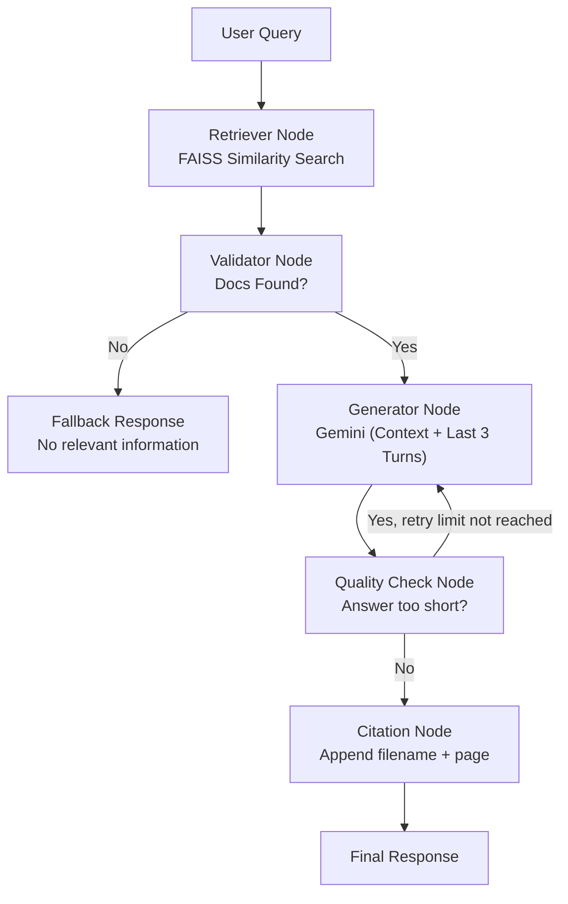

# DocuMind AI - Advanced RAG Document Q&A

DocuMind AI is a FastAPI-based RAG system that lets you upload PDF/TXT files and ask questions grounded in those documents.

## Features

- Document upload (`.pdf`, `.txt`)
- Chunking + embeddings + FAISS vector search
- LangGraph workflow with conditional routing
- Context-only generation using Gemini
- Citation appending (`filename`, `page`)
- Lightweight conversation memory (last 3 turns for follow-ups)
- Short-answer quality check with optional regeneration

## Project Structure

- `main.py`: app entrypoint, CORS, API mounting, static UI hosting
- `api/endpoints.py`: upload/query API routes and conversation memory store
- `core/rag.py`: loaders, chunking, embeddings, FAISS index management
- `core/graph.py`: LangGraph nodes and conditional edges
- `static/`: frontend files (`index.html`, `app.js`, `style.css`)
- `db/faiss_index/`: persisted vector index
- `uploads/`: uploaded user files

## How To Run

1. Create and activate virtual environment:

```bash
python3 -m venv venv
source venv/bin/activate
```

2. Install dependencies:

```bash
pip install -r requirements.txt
```

3. Configure environment variable in `.env`:

```env
Gemini_API_Key=your_gemini_api_key_here
```

4. Start server:

```bash
uvicorn main:app --host 0.0.0.0 --port 8000 --reload
```

5. Open app in browser:

```text
http://localhost:8000
```

## Gemini API Key Setup

1. Generate a Gemini API key from Google AI Studio.
2. Put the key in `.env`:
   `Gemini_API_Key=...`
3. Restart the server after updating `.env`.

## LangGraph Architecture Diagram



## Notes

- Conversation memory is currently in-process memory (not per-user persistent storage).
- CORS is open for development (`allow_origins=["*"]`).

## Demo Assets

- Sample PDFs: `/Users/prakashsamanta/workSpace/assignment1/demo/sample_policy_handbook.pdf`, `/Users/prakashsamanta/workSpace/assignment1/demo/sample_product_release_notes.pdf`
- Demo questions and flow: `/Users/prakashsamanta/workSpace/assignment1/demo/DEMO_GUIDE.md`
