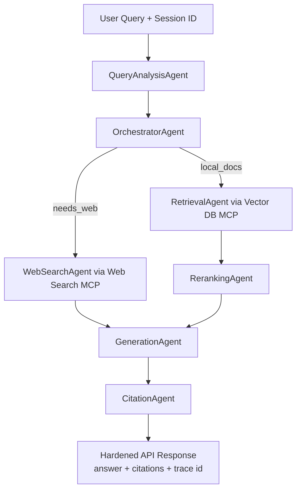

# DocuMind AI - Multi-Agent RAG With MCP

DocuMind AI is a FastAPI + LangGraph document Q&A app with hybrid retrieval, reranking, MCP adapters, session memory, and citation-aware answers.

## Setup

1. Create and activate venv:
```bash
python3 -m venv venv
source venv/bin/activate
```

2. Install dependencies:
```bash
pip install -r requirements.txt
```

3. Start Ollama:
```bash
ollama pull llama3:8b
brew services start ollama
```

4. Configure `.env`:
```env
LLM_PROVIDER=ollama
LLM_MODEL=llama3:8b
LLM_TIMEOUT_SECONDS=45

MCP_ENABLED=false
MCP_TIMEOUT_SECONDS=8
MCP_FAILOVER_LOCAL=true
MCP_WEB_SEARCH_ENABLED=false
MCP_WEB_SEARCH_URL=http://127.0.0.1:9101/search
MCP_VECTOR_DB_ENABLED=false
MCP_VECTOR_DB_URL=http://127.0.0.1:9102/vector/hybrid_search
MCP_DOC_PROCESSING_ENABLED=false
MCP_DOC_PROCESSING_URL=http://127.0.0.1:9103/doc/process
```

5. Run server:
```bash
uvicorn main:app --host 0.0.0.0 --port 8000 --reload
```

6. Open:
`http://localhost:8000`

## Architecture



## Required Agents (Short Note)

- `OrchestratorAgent`: decides branch (web-search path vs local retrieval path).
- `QueryAnalysisAgent`: classifies intent and flags `needs_web`.
- `RetrievalAgent`: gets hybrid candidates through Vector DB MCP (or local failover).
- `RerankingAgent`: ranks candidates with cross-encoder / LLM / heuristic fallback.
- `GenerationAgent`: produces final grounded answer from context/history.
- `CitationAgent`: composes citation strings (`filename`, `page`).

## MCP Integration

Adapters are in `core/mcp/`:
- `web_search_mcp.py`
- `vector_db_mcp.py`
- `doc_processing_mcp.py`

Behavior:
- If MCP is enabled and endpoint is reachable, adapter uses remote MCP service.
- If MCP fails and `MCP_FAILOVER_LOCAL=true`, it falls back to local behavior.

## API Summary

- `POST /api/upload`
- `POST /api/query`
- `GET /api/conversations/{conversation_id}`
- `POST /api/conversations/{conversation_id}/reset`

`/api/query` returns:
- `answer`
- `citations`
- `supporting_chunks` (only if debug mode)
- `agent_trace_id`
- `session_id`
- `latency_ms`

## Troubleshooting

1. Ollama connection errors
- Ensure `brew services start ollama`
- Run `ollama list`

2. Model missing
- Run `ollama pull llama3:8b`
- Verify `.env` `LLM_MODEL`

3. MCP endpoints unavailable
- Keep `MCP_ENABLED=false` for local mode
- Or keep `MCP_FAILOVER_LOCAL=true` for graceful fallback

4. OCR not running
- Install system Tesseract and Python packages (`pytesseract`, `Pillow`)
- OCR path is optional; app still processes text-layer PDFs without OCR

5. Offline environment warnings (HF model fetch)
- Use offline flags for tests/benchmark:
```bash
HF_HUB_OFFLINE=1 TRANSFORMERS_OFFLINE=1 ./venv/bin/python -m unittest -q
```

## Demo Assets

- `demo/sample_policy_handbook.pdf`
- `demo/sample_product_release_notes.pdf`
- `demo/sample_scanned_text_ocr.pdf` (OCR demo file)
- `demo/DEMO_GUIDE.md`
- `demo/DEMO_SUCCESS_SCRIPT.md`
